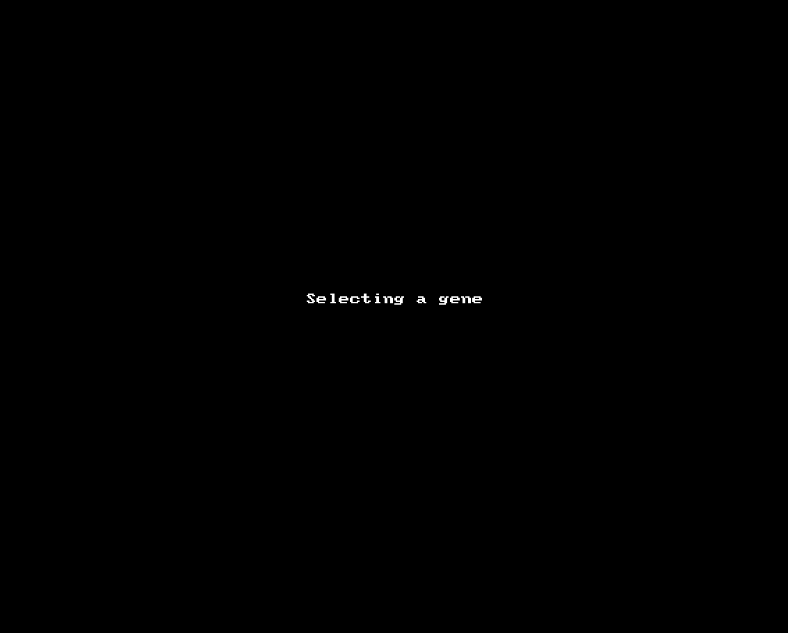
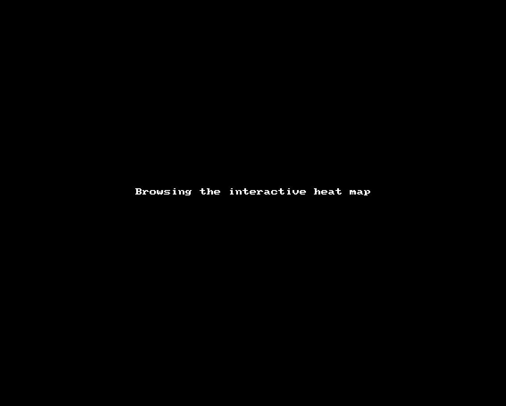
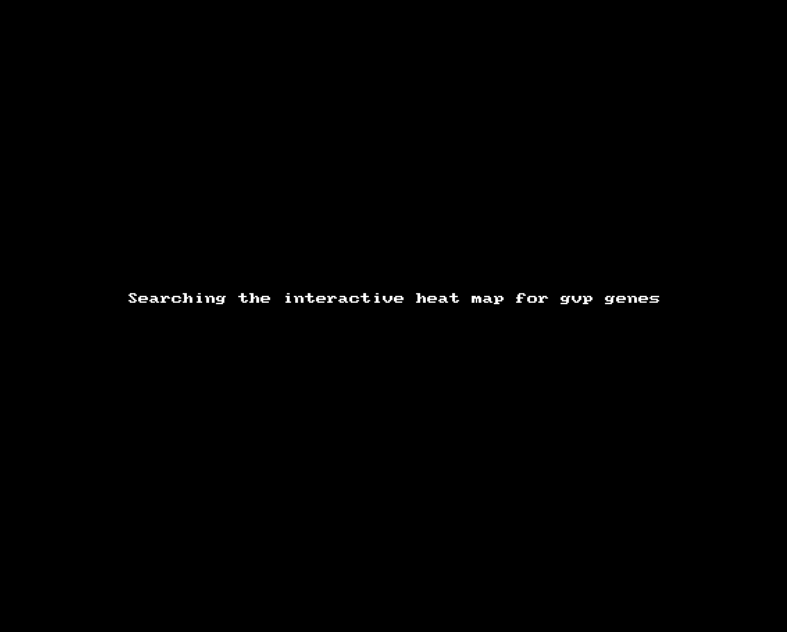
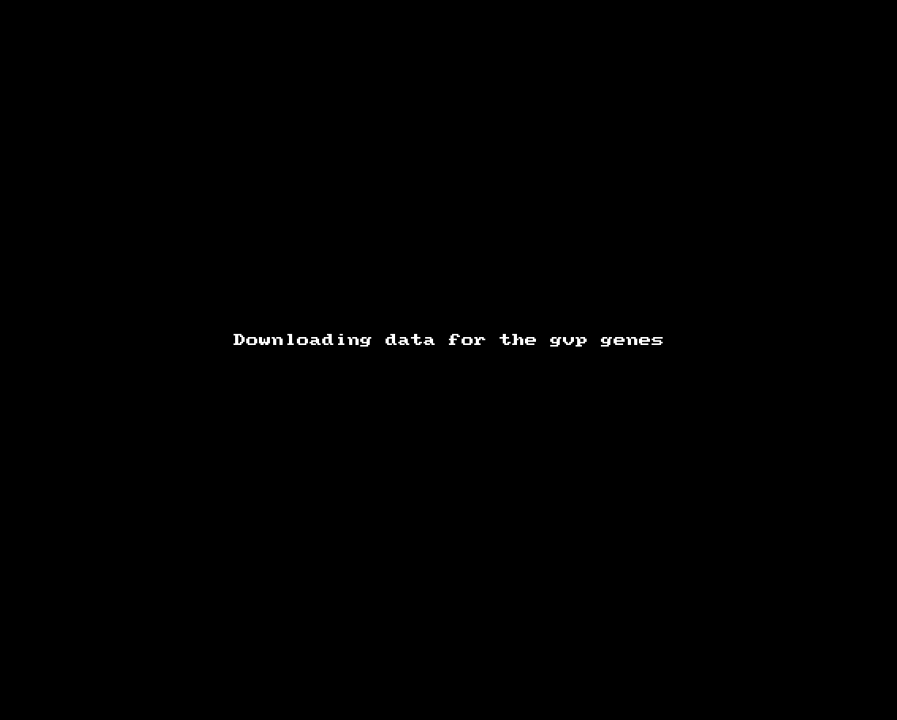

# Home

Welcome to the *H. salinarum* NRC-1 Atlas! In this web portal, you can explore a multiomics growth curve experiment for this archaeal organism. Below, you will find an interactive table with linked locus tags that will take you to a single-nucleotide resolution genome browser displaying time point-wise transcriptome profiles and miscellaneous features for a given gene and its neighbors. You can also browse the data by visualizing an interactive heat map of all genes with their transcript and proteins levels accompanied by miscellaneous features (["Atlas"](https://halodata.systemsbiology.net/heatmap) tab). For the best user experience, please, use the [Google Chrome Browser](https://www.google.com/intl/en-US/chrome/). The ["About"](https://halodata.systemsbiology.net/about) section provides a detailed description of this web portal.

# About

## Table of contents

**\<WE NEED A TABLE OF CONTENTS HERE (TWO-LEVELS ARE ENOUGH). THIS IS AN EXTENSIVE DESCRIPTION PAGE\>**

## Introduction

The *H. salinarum* NRC-1 Atlas is a web resource conceived to support the discovery of potential post-transcriptional regulation mechanisms by observing multiomics data of a growth curve experiment and miscellaneous features obtained from public data. It debuted as a companion web portal for the manuscript entitled "*A genome-scale atlas reveals complex interplay of transcription and translation in an archaeon*" (Lorenzetti *et al.*, 2022). Below, we describe each section of this web portal.

## Portal description

### Home

The landing page for this web portal shows three searchable tables that can be activated by clicking on their respective tabs:

-   **Locus tag:** This table brings an index of the genes you can browse. Each row starts with a non-redundant representative open reading frame (column #1) followed by its symbol (column #2), its protein product (column #3), and a list of locus tags corresponding to (quasi)identical genes within the same annotation effort or coming from other resources (e.g., strain R1). If you need more details on how this non-redundant set of genes was generated, please, refer to [*H. salinarum* NRC-1 non-redundant transcriptome resource](https://github.com/alanlorenzetti/halo_nr_tx);

-   **COG Info:** This table brings information retrieved from the [clusters of orthologous genes (COG)](https://www.ncbi.nlm.nih.gov/research/cog/) database [(Galperin, et al., 2021)](https://pubmed.ncbi.nlm.nih.gov/33167031/). For each representative open reading frame (column #1), we list the ID (column #2), the enunciate (column #3), the category (column #4), and the functional pathway (column #5);

-   **IS Info:** This table brings a non-redundant set of insertion sequences (mobile genetic elements). The open reading frames (column #1) are localized within the named insertion sequences (column #2) from various families (column #3) and subgroups (column #4).

Clicking on the linked locus tags will take you to a page dedicated to the selected gene. It should take about 30 seconds to load the page. There, you will get general information about the gene and a genome browser centering the region of interest and its neighbors. Notice that you cannot go far right or left, because the features will disappear after a few kilobases. That is a consequence of downsizing the data sets to avoid memory-related crashes. If you would like to browse another gene, please, go back to the "Home" section and start your search over again.

All the genes can be explored using the genome browser, but not all of them will show miscellaneous information. Below, we list a set of features that can be displayed for a selected gene.

-   **Annotations:** The location following the format "replicon start end" (column #1); clusters of orthologous genes ID (column #2); possibly deprecated GenBank ID (column #3); gene symbol (column #4); **\<FROM WHERE?\>**

-   **Genome Browser:** This subsection displays an embedded genome browser window powered by [igv.js](https://github.com/igvteam/igv.js/). From top to bottom, the tracks are:

    -   **The nucleotide sequence** and its three-frame translation (only visible when zoomed-in);

    -   **Ribo-Seq TP1-4 (+):** Normalized read depth tracks for the ribosome profiling experiment (positive strand) sampled from four consecutive time points of a growth curve **(**TP1: early exponential growth phase; TP2: mid-exponential growth phase; TP3: late exponential growth phase; TP4: stationary phase). Mean of three replicates;

    -   **RNA-Seq TP1-4 (+):** Normalized read depth tracks for the RNA-Seq experiment (positive strand) sampled from four consecutive time points of a growth curve **(**TP1: early exponential growth phase; TP2: mid-exponential growth phase; TP3: late exponential growth phase; TP4: stationary phase). Mean of three replicates;

    -   **TPS (+):** Transcript processing sites (positive strand) collected from [Ibrahim *et al.* (2021)](https://pubmed.ncbi.nlm.nih.gov/34209065/);

    -   **SmAP1 interaction (+):** Protein-RNA interaction inferred from a SmAP1-RNA co-immunoprecipitation assay followed by next generation sequencing (positive strand);

    -   **Antisense RNAs:** Antisense RNA annotation from [de Almeida *et al*. (2019)](https://pubmed.ncbi.nlm.nih.gov/30959844/);

    -   **Genes:** Gene and coding sequence (CDS) annotation from [Pfeiffer *et al.* (2019)](https://pubmed.ncbi.nlm.nih.gov/31296677/);

    -   **IS annotation:** Insertion sequence annotation from [Pfeiffer *et al.* (2019)](https://pubmed.ncbi.nlm.nih.gov/31296677/);

    -   **SmAP1 interaction (-):** Protein-RNA interaction inferred from a SmAP1-RNA co-immunoprecipitation assay followed by next generation sequencing (negative strand);

    -   **TPS (-):** Transcript processing sites (negative strand) collected from [Ibrahim *et al.* (2021)](https://pubmed.ncbi.nlm.nih.gov/34209065/);

    -   **Ribo-Seq TP1-4 (-):** Normalized read depth tracks for the ribosome profiling experiment (negative strand) sampled from four consecutive time points of a growth curve **(**TP1: early exponential growth phase; TP2: mid-exponential growth phase; TP3: late exponential growth phase; TP4: stationary phase). Mean of three replicates;

    -   **RNA-Seq TP1-4 (-):** Normalized read depth tracks for the RNA-Seq experiment (negative strand) sampled from four consecutive time points of a growth curve **(**TP1: early exponential growth phase; TP2: mid-exponential growth phase; TP3: late exponential growth phase; TP4: stationary phase). Mean of three replicates;

    -   The user can choose whether raw or log-transformed read depth are displayed by unchecking/checking the box located at the top of the genome browser window; it is also possible to customize each track by clicking on the right-hand size gear button.

-   **COG information:** Information collected from the [clusters of orthologous genes (COG)](https://www.ncbi.nlm.nih.gov/research/cog/) database [(Galperin, et al., 2021)](https://pubmed.ncbi.nlm.nih.gov/33167031/);

-   **Gene ontology:** Information collected from \<**FROM WHERE?\>;**

-   **Cross References:** Links to multiple external resources;

-   **Gene Regulatory Network:** Links to environmental gene regulatory influence networks (EGRIN) databases;

-   **Transcript Structure:** Transcript structure for the target gene and its neighbors**;**

-   **Data:** Transcriptome levels measured by microarrays in multiple conditions for the selected gene;

-   **Sequences:** DNA and protein sequences for the selected gene.

### Atlas

This tab displays an interactive heat map powered by [InteractiveComplexHeatmap](https://jokergoo.github.io/InteractiveComplexHeatmap/) and Shiny R packages. It should take about 40 seconds to load the tool using the Google Chrome Browser. Once the tool is loaded, the user should be able to browse a comprehensive heat map including 2,579 protein coding entries (rows) of the *H. salinarum* NRC-1 genome grouped by COG categories. On the left-hand side, we displayed several annotation columns:

-   **COG:** Category according to the [clusters of orthologous genes (COG)](https://www.ncbi.nlm.nih.gov/research/cog/) database [(Galperin et al., 2021)](https://pubmed.ncbi.nlm.nih.gov/33167031/);

-   **Chromosome:** The representative instance is located within the chromosome (NC_002607.1);

-   **pNRC100:** The representative instance is located within the plasmid pNRC100 (NC_001869.1);

-   **pNRC200:** The representative instance is located within the plasmid pNRC200 (NC_002608.1);

-   **SmAP1:** Whether there is at least one SmAP1 binding site on the same strand for a given gene;

-   **asRNA:** Whether there is at least one annotated antisense RNA (asRNA) according to [de Almeida *et al*. (2019)](https://pubmed.ncbi.nlm.nih.gov/30959844/);

-   **TPS:** Whether there is at least one transcript processing site (TPS) on the same strand for a given gene according to [Ibrahim *et al.* (2021)](https://pubmed.ncbi.nlm.nih.gov/34209065/);

-   **2099:** Log2-transformed fold change of RNase_2099C knockout vs. the control strain. Data reanalysis of [Wurtmann *et al.* (2014)](https://pubmed.ncbi.nlm.nih.gov/24612392/);

-   **Half-life:** Experimentally determined half-life of a transcript according to [Hundt *et al.* (2007)](https://pubmed.ncbi.nlm.nih.gov/17644597/);

-   **CAI:** Codon adaptation index computed using the 5% most abundant proteins in this study as the reference set;

-   **GC Content:** Difference (residue) between GC content for a given gene and the mean GC content considering all the genes.

Moreover, the tool shows five heat maps side-by-side, grouped by COG categories and clustered by Protein levels:

-   **Protein:** Log10-transformed proteome quantitative measure (a pseudocount was imputed for missing values) for consecutive time points of a growth curve (TP1: early exponential growth phase; TP2: mid-exponential growth phase; TP3: late exponential growth phase; TP4: stationary phase);

-   **mRNA:** Log10-transformed transcriptome quantitative measure (TPM+1) for consecutive time points of a growth curve (TP1: early exponential growth phase; TP2: mid-exponential growth phase; TP3: late exponential growth phase; TP4: stationary phase);

-   **RPF:** Log10-transformed ribosome mRNA protected fragment quantitative measure (RPF; Ribo-Seq experiment; TPM+1) for consecutive time points of a growth curve (TP1: early exponential growth phase; TP2: mid-exponential growth phase; TP3: late exponential growth phase; TP4: stationary phase);

-   **TE:** Log2-transformed translational efficiency for consecutive time points of a growth curve (TP1: early exponential growth phase; TP2: mid-exponential growth phase; TP3: late exponential growth phase; TP4: stationary phase). Given by Protein divided by mRNA in a time point-wise manner;

-   **RO:** Log2-transformed ribosome occupancy for consecutive time points of a growth curve (TP1: early exponential growth phase; TP2: mid-exponential growth phase; TP3: late exponential growth phase; TP4: stationary phase). Given by RPF divided by mRNA in a time point-wise manner.

### Atlas (Static)

This is an static version of the same heat map displayed in the ["Atlas"](https://halodata.systemsbiology.net/heatmap) section. It should take about one minute to load the static heat map using the Google Chrome Browser. We realized that computers with old hardware and/or slow internet connections might not be able to successfully load the interactive heat map, so we built this static version. Please, see the download section below to download it as a PDF file.

## Usage examples

### Selecting a gene to open in the genome browser

### Browsing the mobilome cluster using the interactive heat map

### Using the interactive heat map search tool

For that, we are going to use a comma-separated set of locus tags for genes comprising the *gvp* cluster. Only representative locus tags are allowed (see column #1 in the table at the "Home" section for all the possible entries).

`VNG_7015,VNG_7016,VNG_7017,VNG_7018,VNG_7019,VNG_7020,VNG_7021,VNG_7022,VNG_7023,VNG_7024,VNG_7025,VNG_7026,VNG_7027,VNG_7028`

### Downloading data for the *gvp* gene cluster demonstrated above

## Data download

You can download data for the:

-   **Genome browser:** a bundle containing all the tracks is available [here](data/igv_bundle.tar.gz);

-   **Atlas:** the entire table used to generate the interactive heat map is available [here](data/File_S1.xlsx) and as a supplement file in our manuscript (protein levels, RNA-Seq levels, Ribo-Seq levels, translational efficiency, and ribosome occupancy are not log transformed in this version; the column description is available inside the workbook);

-   **Atlas (Static):** a PDF file for the static heat map is available [here](data/File_S8.pdf).

## Citation

If you make use of this web portal or the data we made public, please, cite:

Lorenzetti *et al.* (2022). "A genome-scale atlas reveals complex interplay of transcription and translation in an archaeon*"*. *Journ. Nam*., X(n), XX-XX.

## Bugs and feature requests

The code for this web portal is public available at the [GitHub](https://github.com/baliga-lab/halodata). Please, leave your bug reports, suggestions, and feature requests [here](https://github.com/baliga-lab/halodata/issues).
